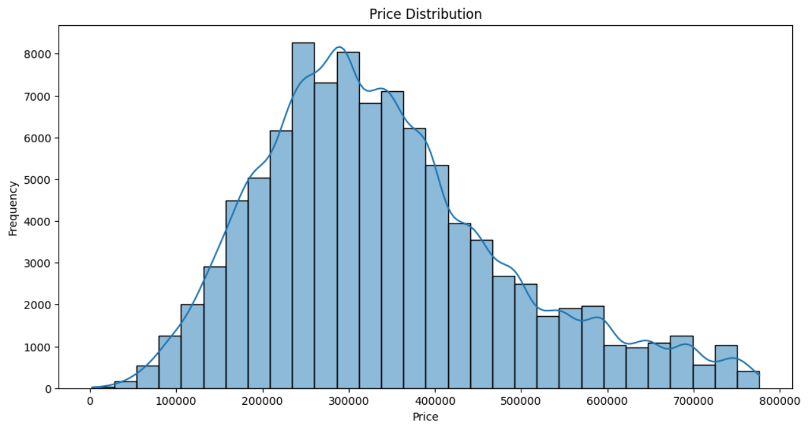
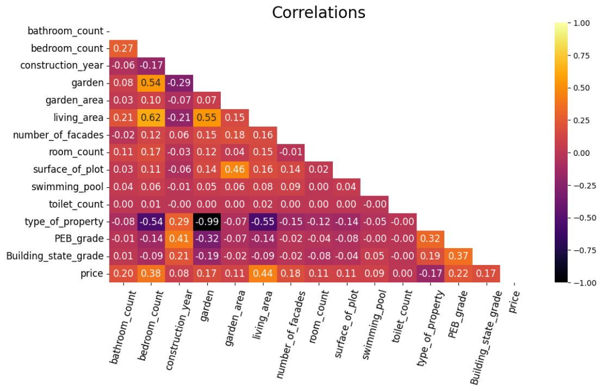

# IMMO-ELIZA-Belgium
## A Project for Price Prediction for Properties in Belgium-Part 2

### Description 
This is a six-week project aimed at predict the house prices in Belgium. The project includes the following stages: **1.  Data Scraping:** Collecting data from Immoweb. 
**2.  Data Cleaning, Analysis, and Visualization:** Processing and exploring the data to extract meaningful insights.
**3.  Machine Learning:** Developing predictive models to estimate property prices.
**4.  App Development:** Building an application for users to interact with and use the price prediction models.
In this repository, you will find detailed documentation and code related to the **machine learning models** and the **app development** process.

### Details
**Machine Learning Models**
**1. Data Preprocessing**
This step based on the data cleaning and analysis stage, which avoiding duplicates and null values, and finally determine the features for modeling. For categorical features, such as "district", "type of property", a onehot encoder were applied; and features like "PEB" and "building state" were graded. For the target variable "price," an IQR (Interquartile Range) method was applied to clean the outlier values.. 

Moreover, a hotmap was used for feature selction. 

**2. Data formatting**
Dataset was divided for training and testing. (X_train, y_train, X_test, y_test) to apply the models, and the test_size = 0.17.
**3. Model evaluation**
The following models were tested: 
-Multiple Linear Regression (mae=13470393138.732042, r2=0.3598)
-Gradient Boosting Regressor (mae=70222.05803619919 , r2=0.5657530850614323 ) 
-Random Forest Regression (mae=68064.41199909725 , r2=0.5729080864923147) 
-XGbooster (mae=69716.98485641864, r2=0.572946573951231)
Random Forest Regression was choosen as a model for APP development. 

**App Development** 
**1. Model Save** 
The chosen Random Forest Regression model was saved as a joblib file. This serialized model file is used for deployment and loading the model in the Streamlit application for predictions. The model is saved using the joblib library to ensure efficient storage and retrieval.
**2. Streamit App Build-Up** 
The Streamlit application was developed to provide an interactive interface for users to input property details and receive price predictions. Key features of the app include:
**-User Input Form:** Allows users to enter property attributes such as district, type of property, energy performance, and building state.
**-Model Integration:** Loads the saved joblib model and uses it to generate predictions based on user inputs.
**-Results Display:** Shows the predicted property price to the user in a clear and user-friendly format.
**-Public Accessibility:** The app is hosted on a web server, making it accessible to anyone with an internet connection. This ensures that users can easily access the app from any device without needing to install additional software.

### Usage
To use the application, click the following link and input the property features: [IMMO-ELIZA Streamlit App](https://emma-immo-eliza-belgium.streamlit.app). The app will provide a prediction for the property's price based on the features you enter. 

### Contributing
The first two stages of this project were completed by the team. Part 2 of the project, including model evaluation and Streamlit app development, was completed by Hui Shang. Contributions and improvements to the project are welcome!

### Notes
This is the first major project I have undertaken, and there are several areas for improvement, including:
**-Data Preprocessing:** Refining techniques for handling and preparing data.
**-Model Selection:** Exploring additional models and optimization strategies.
**-App Interface:** Enhancing the user interface for a more intuitive and user-friendly experience.
Feedback and suggestions for improvement are appreciated as I continue to develop and refine this project.

